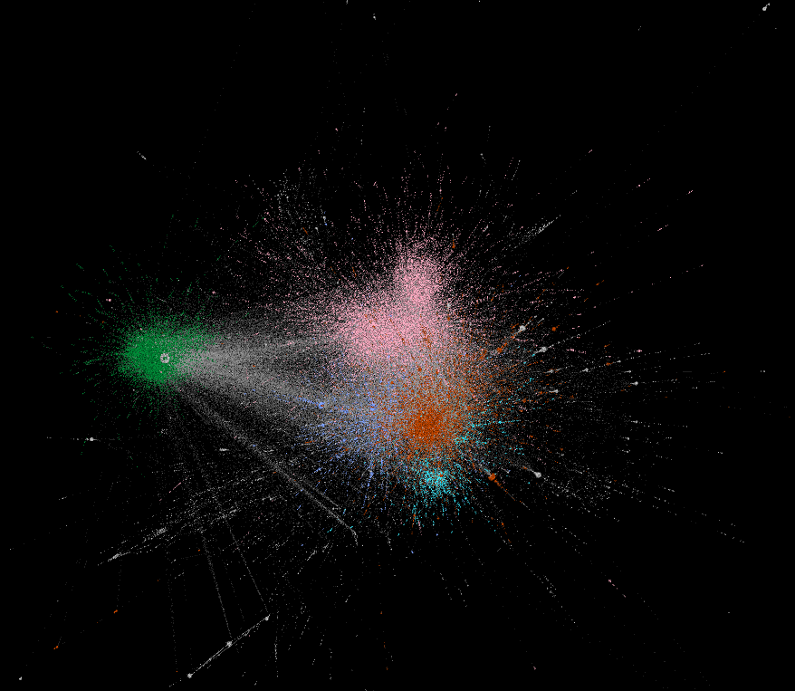
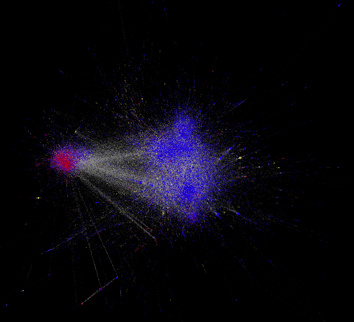

This is a research project on exploring  of online vaccination discussion and how it manifested in retweet network communities.

Three percent of the dataset is labeled as pro-vaccine, anti-vaccine, or neutral to vaccination. The labeled data is available in this repository and feel free to use it. The whole dataset is not included but available upon request.

These two pretty pictures are from this research as well:

  
  

How the data was labeled?
Two people labeled the data with 10 percent overlap. Before labeling, a criteria was established on how to define each labels. While positive and negative is more intuitive, they then agreed on defining neural tweets as those only contain facts, such as news reports or research results. The conflict labels from two annotators were solved by manual checking.

## References: 

**Yuan, X., Schuchard, R. and Crooks, A.T. (2019)**, Examining Emergent Communities and Detecting Social Bots within the Polarized Online Vaccination Debate in Twitter, *Social Media + Society*. Available at <https://doi.org/10.1177/2056305119865465>. [(pdf)](https://www.dropbox.com/s/35u6qg9kiohkcbe/Bots_Vaccination.pdf?dl=0)

 **Yuan, X. and Crooks, A.T. (2018)**, Examining Online Vaccination Discussion and Communities in Twitter, *Proceedings of the 9th International Conference on Social Media and Society*, Copenhagen, Denmark, pp.197-206. [(pdf)](https://www.dropbox.com/s/pogwxaon10j8m9s/Yuan_Crooks_SMS_2018.pdf?dl=0)
